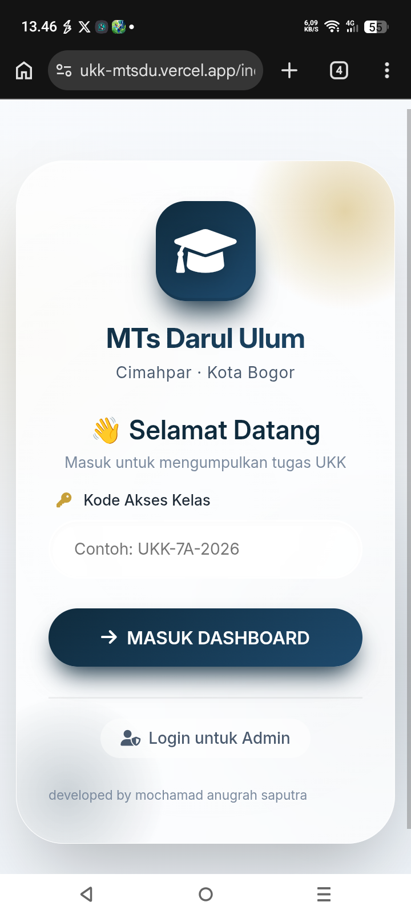

UKK MTsDU

<p align="center">
  <strong>MTs Darul Ulum — UKK Management System</strong>
  <br>
  Student Portal & Administrative Management System
</p><p align="center">
  <a href="https://ukk-mtsdu.vercel.app">
    
  </a>
  
  
  
</p>---

Overview

UKK MTsDU is a web-based management system developed for the implementation of UKK activities at MTs Darul Ulum.

The application separates access between students and administrators, providing different interfaces and workflows for each role.

The interface follows a clean visual system based on deep navy, white, and gold, combined with rounded surfaces, glass-style components, and responsive layouts.

---

Application

Student Portal

The student portal is the main entry point for UKK participants.

Students can access their dashboard using a class access code.

Flow:

"Access Code → Student Dashboard → UKK Activities"

Admin Panel

The administrator has a separate authentication interface and management environment.

The admin side is designed for managing and monitoring UKK-related data.

Flow:

"Admin Code → Admin Dashboard → Management"

---

Features

Student

- Class access authentication
- Student dashboard
- UKK activity access
- Responsive mobile interface
- Dedicated student experience

Administrator

- Admin authentication
- Administrative dashboard
- Class management
- Class inspection
- Grade management
- Data recap
- Separate privileged interface

Interface

- Responsive design
- Mobile-first layout
- Glassmorphism-inspired components
- Navy / white / gold visual system
- Custom CSS
- Client-side JavaScript interaction
- Lightweight frontend architecture

---

Tech Stack

Technology| Purpose
HTML5| Page structure
CSS3| Styling & responsive layout
JavaScript| Client-side logic
Vercel| Deployment

---

Project Structure
```text
ukk-mtsdu/
├── assets/
├── css/
├── js/
├── admin-cek-kelas.html
├── admin-dashboard.html
├── admin-kelola-kelas.html
├── admin-login.html
├── admin-nilai.html
├── admin-rekap.html
├── dashboard-murid.html
├── index.html
└── README.md
```
---

Interface Preview

Student Portal

<p align="center">
  
</p>Admin Panel

<p align="center">
  
</p>«Replace the image paths above with the actual screenshots stored in the repository.»

---

Security Considerations

The application contains separate student and administrator access flows.

For production environments, authentication and authorization should be enforced server-side rather than relying exclusively on client-side logic.

Recommended production hardening:

- Server-side authentication
- Role-based authorization
- Secure password hashing
- Input validation
- Session management
- Rate limiting
- Secure HTTP headers
- Environment-based secrets
- Audit logging

Do not commit passwords, access codes, API keys, tokens, or other sensitive credentials to the repository.

---

Deployment

The application is deployed using Vercel.

Production

https://ukk-mtsdu.vercel.app

---

Local Development

Clone the repository:

git clone https://github.com/jhingshaw/ukk-mtsdu.git

Open the project:

cd ukk-mtsdu

For local development, use a local HTTP server.

Example:

python -m http.server 8080

Then open:

http://localhost:8080

---

Status

Active Development

The system can be further extended with:

- Backend services
- Database integration
- Stronger authentication
- Role-based authorization
- Server-side validation
- Audit logging
- Additional administrative modules

---

Developer

JhingShaw

Web Development · Security Enthusiast · Builder

«"learn → build → test → improve"»

---

<p align="center">
  <sub>MTs Darul Ulum — UKK Management System</sub>
  <br>
  <sub>Built with HTML, CSS & JavaScript.</sub>
</p>
